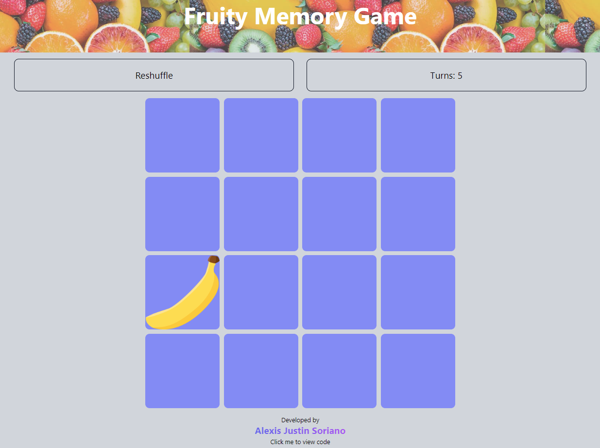

# Memory Game

View live:
https://fruity-memory-game.netlify.app

A simple game made with:  
**React** for building  
**Tailwind CSS** for designing  

 
Screenshot:
 

Developer notes:  
-I created modal for this project  
-I used bg-opacity instead of opacity classname for the modal  
&nbsp;&nbsp;&nbsp;&nbsp;*bg-opacity controls the opacity of the element's background  
&nbsp;&nbsp;&nbsp;&nbsp;*opactiy controls the opacity of the element  

